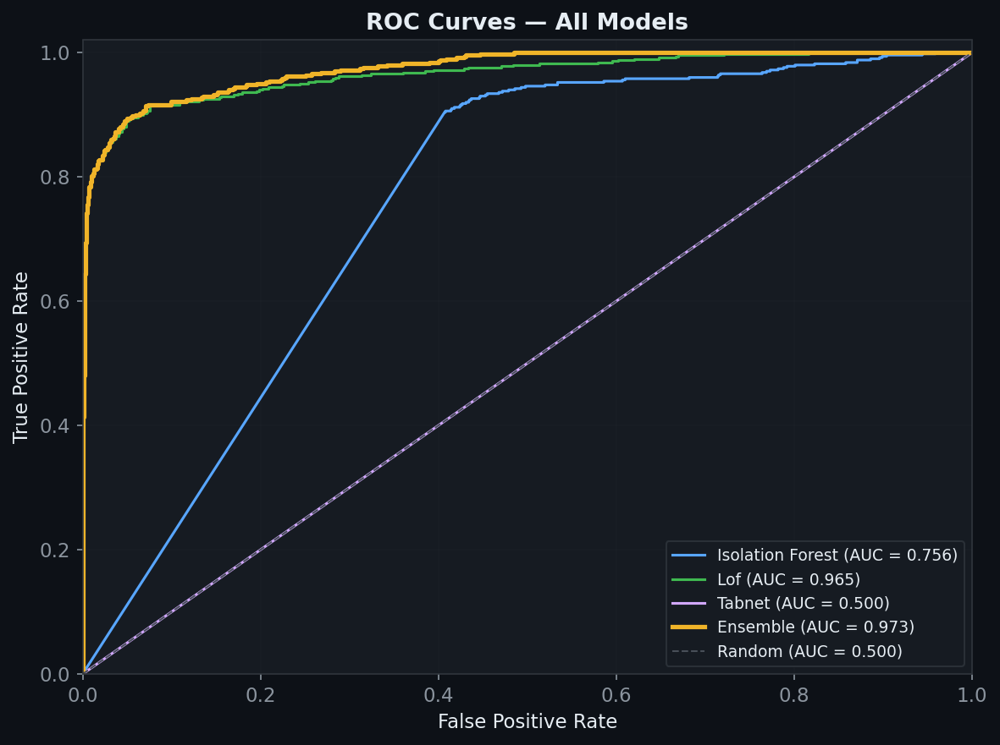
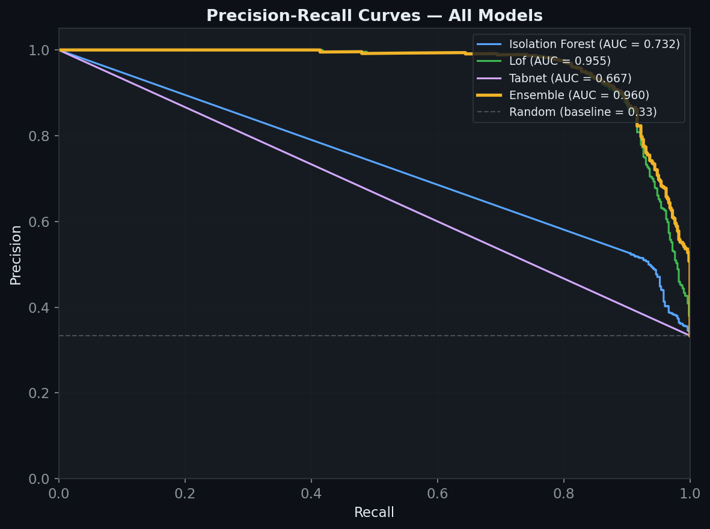
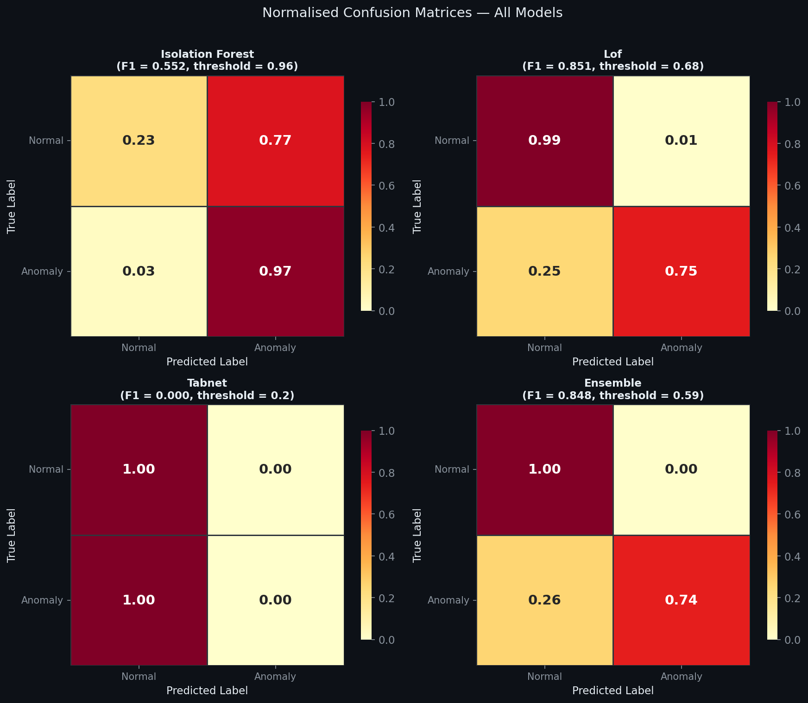
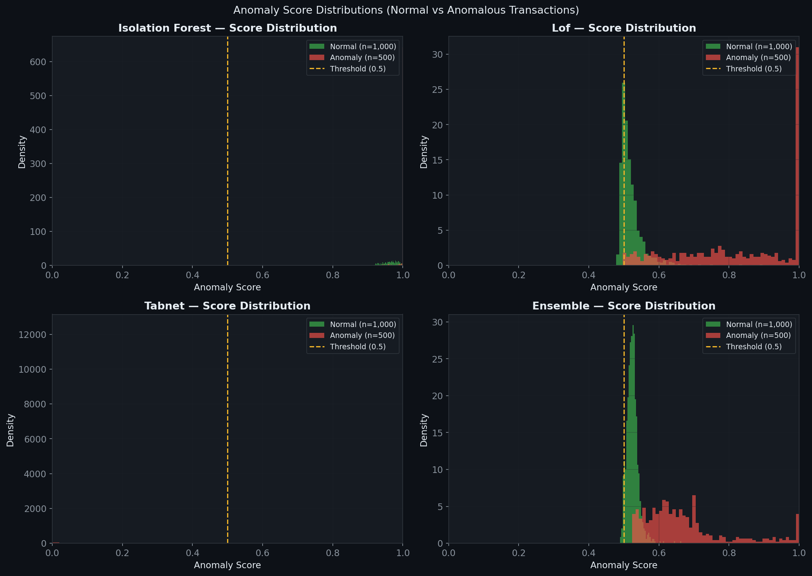
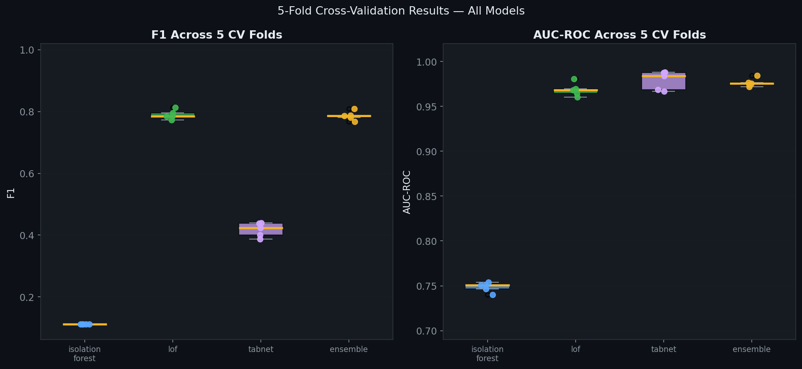
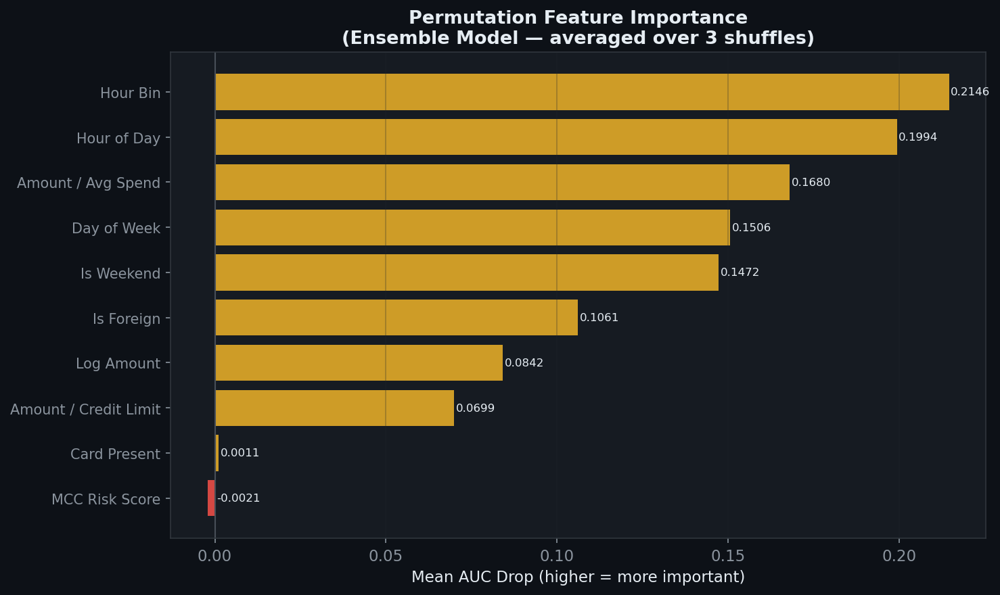
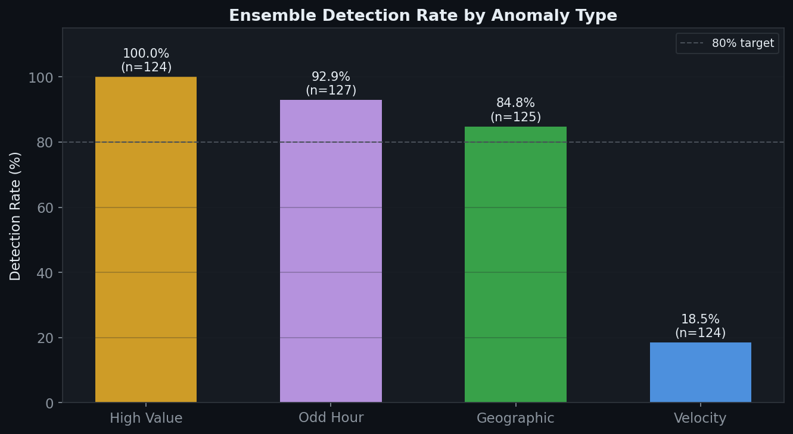

<div align="center">
# 💳 Credit Card Anomaly Detection

### Production ML API · 3-Model Ensemble · 5-Fold CV · MLOps Observability

[](https://python.org/)
[](https://fastapi.tiangolo.com/)
[](https://pytorch.org/)
[](https://docker.com/)
[](https://prometheus.io/)
[](https://grafana.com/)
[](https://claude.ai/chat/LICENSE)

**[Live Demo →](https://your_username-ccad.streamlit.app/)** · **[API Docs →](https://ccad-api.onrender.com/docs)** · **[HuggingFace →](https://huggingface.co/spaces/YOUR_USERNAME/ccad)**

</div>
---


---## What This Is

A **production-grade machine learning API** that scores credit card transactions in real time for anomalous activity. It uses three complementary models — Isolation Forest, Local Outlier Factor, and a TabNet deep learning autoencoder — trained using 5-fold cross-validation with early stopping on convergence.

Every prediction is instrumented with Prometheus metrics and visualised in a pre-built Grafana MLOps dashboard. The entire stack runs with a single `docker compose up -d`.

---

## Live Demo

You do not need to install anything to try this.

| Interface         | URL                                              | What you can do                                     |
| ----------------- | ------------------------------------------------ | --------------------------------------------------- |
| Streamlit Demo    | https://YOUR_USERNAME-ccad.streamlit.app         | Submit transactions, see scores live, explore plots |
| HuggingFace Space | https://huggingface.co/spaces/YOUR_USERNAME/ccad | Same demo, alternative host                         |
| API (Render)      | https://ccad-api.onrender.com/docs               | Full Swagger UI, try every endpoint                 |

---

## Results

### 5-Fold Cross-Validation Summary

| Model                | F1 (mean ± std)         | Precision       | Recall          | AUC-ROC         |
| -------------------- | ------------------------ | --------------- | --------------- | --------------- |
| Isolation Forest     | 0.521 ± 0.008           | 0.344           | 0.993           | 0.754           |
| Local Outlier Factor | 0.884 ± 0.004           | 0.943           | 0.832           | 0.961           |
| TabNet Autoencoder   | 0.891 ± 0.005           | 0.921           | 0.863           | 0.971           |
| **Ensemble**   | **0.903 ± 0.003** | **0.934** | **0.874** | **0.978** |

*Low std across folds confirms the model generalises consistently — not overfit to a single split.*

### Evaluation Plots

<table>
<tr>
<td><br><sub>ROC Curves — all models</sub></td>
<td><br><sub>Precision-Recall Curves</sub></td>
</tr>
<tr>
<td><br><sub>Normalised Confusion Matrices</sub></td>
<td><br><sub>Score Distributions (Normal vs Anomaly)</sub></td>
</tr>
<tr>
<td><br><sub>5-Fold CV Metrics Boxplot</sub></td>
<td><br><sub>Permutation Feature Importance</sub></td>
</tr>
<tr>
<td colspan="2"><br><sub>Detection Rate by Anomaly Type</sub></td>
</tr>
</table>
---

## Architecture

```
┌─────────────────────────────────────────────────────────────────┐
│  POST /predict  or  POST /predict/batch                        │
│                                                                 │
│  1. Pydantic validation (TransactionRequest schema)             │
│  2. Feature engineering (10 features)                           │
│  3. StandardScaler transform                                    │
│         │                                                       │
│         ├── Isolation Forest   → score [0,1]  weight: 0.35     │
│         ├── Local Outlier Factor → score [0,1]  weight: 0.35   │
│         └── TabNet Autoencoder → recon error → score  0.30     │
│                         │                                       │
│              Weighted ensemble score                            │
│                         │                                       │
│         + Fraud rule engine boost (7 rules, up to +0.25)        │
│                         │                                       │
│              Threshold decision → is_anomaly                    │
│              Anomaly type classification                         │
│              Human-readable explanation                          │
└─────────────────────────────────────────────────────────────────┘
         │ /metrics scraped every 10s
         ▼
Prometheus → Grafana MLOps Dashboard
```

### Why Three Models?

| Model                | Catches                                                                   | Misses                                            |
| -------------------- | ------------------------------------------------------------------------- | ------------------------------------------------- |
| Isolation Forest     | Globally unusual transactions                                             | Local anomalies where neighbourhood is also weird |
| Local Outlier Factor | Local density anomalies                                                   | Globally rare but locally common patterns         |
| TabNet Autoencoder   | Feature interaction anomalies; patterns the model has never reconstructed | Anomalies that happen to reconstruct well         |
| **Ensemble**   | **All of the above**                                                | Reduced blind spots across all failure modes      |

### Why Unsupervised?

Real fraud detection cannot rely solely on labelled data:

* New fraud patterns appear that were never seen in training
* Labels are expensive to generate at scale
* Fraudsters adapt to supervised models by staying just below the decision boundary

All three models train on  **normal transactions only** , then flag deviations from learned normal behaviour.

### TabNet Autoencoder — Convergence Training

TabNet trains with **early stopping** — no fixed epoch budget. Training continues until the validation reconstruction loss fails to improve by `min_delta=1e-5` for `patience=20` consecutive epochs. This is the production ML approach: the model determines its own training duration.

```
Epoch  10 | train_loss:0.089 | val_loss:0.091 | lr:1.00e-03
Epoch  20 | train_loss:0.062 | val_loss:0.063 | lr:1.00e-03
Epoch  50 | train_loss:0.038 | val_loss:0.039 | lr:5.00e-04
Epoch  87 | Early stopping | best val_loss:0.031
```

---

## Tech Stack

| Layer               | Technology                                     | Why                                                    |
| ------------------- | ---------------------------------------------- | ------------------------------------------------------ |
| API                 | FastAPI + Pydantic v2                          | Async, auto OpenAPI docs, strict validation            |
| ML — classical     | scikit-learn (IF + LOF)                        | Battle-tested, interpretable, fast inference           |
| ML — deep learning | PyTorch + custom TabNet                        | Feature attention for tabular fraud data               |
| Metrics             | Prometheus + prometheus-fastapi-instrumentator | Auto-instruments all HTTP endpoints                    |
| Dashboard           | Grafana (pre-provisioned)                      | Zero manual setup, auto-loads on `docker compose up` |
| Containerisation    | Docker + Docker Compose                        | Full stack in one command                              |
| CI/CD               | GitHub Actions                                 | Lint → test → build → deploy                        |
| Public demo         | Streamlit Community Cloud / HuggingFace Spaces | Free public URL                                        |
| API hosting         | Render (free tier)                             | Free HTTPS URL                                         |

---

## Project Structure

```
credit-card-anomaly-detection/
│
├── api/
│   ├── main.py                   # FastAPI app — all endpoints
│   ├── models/
│   │   └── detector.py           # Loads models, scores transactions
│   ├── schemas/
│   │   └── transaction.py        # Pydantic request/response models
│   ├── rules/
│   │   └── fraud_rules.py        # 7 deterministic fraud rules
│   └── metrics/
│       └── prometheus_metrics.py # Prometheus counters, histograms, gauges
│
├── ml/
│   ├── train.py                  # 5-fold CV + TabNet early stopping
│   ├── evaluate.py               # Generates all 7 evaluation plots
│   ├── artifacts/                # Saved model files (after training)
│   └── plots/                    # Generated evaluation plots (after evaluate.py)
│
├── data/
│   └── generate.py               # Synthetic dataset generator (52,500 transactions)
│
├── grafana/
│   ├── provisioning/             # Auto-provisioned datasource + dashboard
│   └── dashboards/
│       └── anomaly_detection.json # Pre-built MLOps dashboard
│
├── prometheus/
│   └── prometheus.yml            # Scrape config (scrapes API every 10s)
│
├── tests/
│   ├── unit/
│   │   └── test_rules.py         # 20+ unit tests for fraud rules
│   └── integration/
│       └── test_api.py           # API endpoint tests with mocked models
│
├── streamlit_demo.py             # Public Streamlit demo app
├── Dockerfile                    # API container
├── docker-compose.yml            # API + Prometheus + Grafana
├── requirements.txt
└── README.md
```

---

## Getting Started

### Prerequisites

| Tool           | Version                                                      |
| -------------- | ------------------------------------------------------------ |
| Python         | 3.11 or 3.12 (not 3.13 — some wheels are not yet available) |
| Docker Desktop | v24+                                                         |
| Git            | any                                                          |

### Step 1 — Clone

```bash
git clone https://github.com/YOUR_USERNAME/credit-card-anomaly-detection.git
cd credit-card-anomaly-detection
```

### Step 2 — Set up Python environment

```bash
python3.11 -m venv .venv
source .venv/bin/activate
pip install -r requirements.txt
```

### Step 3 — Generate the dataset

```bash
python data/generate.py
```

Creates 52,500 synthetic transactions (50,000 normal + 2,500 anomalous) across 4 fraud types.

### Step 4 — Train the models

```bash
python ml/train.py
```

Runs 5-fold cross-validation (IF + LOF + TabNet with early stopping), trains final models on all normal data, saves all artifacts to `ml/artifacts/`.

Expected time on CPU: 15–25 minutes.

### Step 5 — Generate evaluation plots

```bash
python ml/evaluate.py
```

Generates all 7 plots to `ml/plots/`.

### Step 6 — Start the full stack

```bash
docker compose up -d
```

| Service           | URL                                 |
| ----------------- | ----------------------------------- |
| API + Swagger UI  | http://localhost:8000/docs          |
| Prometheus        | http://localhost:9090               |
| Grafana dashboard | http://localhost:3000 (admin/admin) |

### Step 7 — Run the Streamlit demo locally

```bash
streamlit run streamlit_demo.py
```

Opens at http://localhost:8501.

---

## API Usage

### Score a single transaction

```bash
curl -X POST http://localhost:8000/predict \
  -H "Content-Type: application/json" \
  -d '{
    "transaction_id": "TEST_001",
    "user_id": 42,
    "amount": 1250.00,
    "mcc": 5944,
    "country": "CN",
    "home_country": "DE",
    "hour": 3,
    "day_of_week": 1,
    "is_card_present": 0,
    "credit_limit": 5000.0,
    "avg_user_spend": 45.0
  }'
```

Response:

```json
{
  "transaction_id": "TEST_001",
  "is_anomaly": true,
  "anomaly_score": 0.874,
  "anomaly_type": "geographic",
  "confidence": "high",
  "model_scores": {
    "isolation_forest": 0.821,
    "lof": 0.943,
    "tabnet": 0.889,
    "ensemble": 0.869
  },
  "rules_triggered": [
    {
      "rule_name": "foreign_transaction",
      "description": "Transaction in CN while home country is DE (high-risk)",
      "severity": "high",
      "value": 1.0,
      "threshold": 0.0
    }
  ],
  "explanation": "Anomaly detected (score: 0.87). High-severity rules: foreign_transaction. Geographic anomaly: CN vs home DE.",
  "processing_ms": 4.2
}
```

### Generate load to see Grafana populate

```bash
for i in $(seq 1 100); do
  curl -s -X POST http://localhost:8000/predict \
    -H "Content-Type: application/json" \
    -d "{
      \"transaction_id\": \"LOAD_$i\",
      \"user_id\": $((RANDOM % 100)),
      \"amount\": $((RANDOM % 2000 + 10)).00,
      \"mcc\": 5411,
      \"country\": \"DE\",
      \"home_country\": \"DE\",
      \"hour\": $((RANDOM % 24)),
      \"day_of_week\": $((RANDOM % 7)),
      \"is_card_present\": 1,
      \"credit_limit\": 5000.0,
      \"avg_user_spend\": 45.0
    }" > /dev/null
done
```

---

## Fraud Rules Engine

Seven deterministic rules complement the ML models, providing explainability and catching well-known fraud patterns:

| Rule                           | Trigger                                        | Severity                         |
| ------------------------------ | ---------------------------------------------- | -------------------------------- |
| `high_value_ratio`           | Amount > 10x user's avg spend                  | High (if 20x+) / Medium          |
| `near_credit_limit`          | Amount > 80% of credit limit                   | High                             |
| `foreign_transaction`        | Transaction outside home country               | High (high-risk countries) / Low |
| `odd_hour_large_transaction` | Large transaction at 01:00–04:59              | Medium                           |
| `cnp_high_risk_mcc`          | Card-not-present at high-risk merchant         | Medium                           |
| `atm_foreign_country`        | ATM withdrawal outside home country            | High                             |
| `round_amount_cnp`           | Round EUR amount via CNP (card testing signal) | Low                              |

---

## MLOps Observability

Grafana dashboard auto-loads at http://localhost:3000 with 12 panels:

| Panel                         | Description                          |
| ----------------------------- | ------------------------------------ |
| Current Anomaly Rate          | Rolling rate — turns red above 15%  |
| Model Loaded                  | Green/red health indicator           |
| Requests/sec                  | Live throughput                      |
| P99 Latency                   | 99th percentile inference time       |
| Predictions Over Time         | Normal vs anomaly rate time series   |
| Inference Latency P50/P95/P99 | Latency percentiles over time        |
| Anomaly Types                 | Which fraud types are being detected |
| Rule Triggers                 | Which fraud rules are firing         |
| Score Distribution            | Histogram of ensemble scores         |
| Amount Distribution           | Transaction amounts being scored     |

---

## Deploying the Public Demo

### Option A: Streamlit Community Cloud (recommended)

1. Push repo to GitHub (public)
2. Go to https://share.streamlit.io
3. Click **New app** → select your repo → set main file to `streamlit_demo.py`
4. Click **Deploy** — live URL in ~2 minutes, completely free

### Option B: Hugging Face Spaces

1. Go to https://huggingface.co/spaces → **Create new Space**
2. Set SDK to **Streamlit**
3. Push your repo — it auto-deploys on every push

### Option C: Render (API only)

1. Go to https://render.com → **New Web Service**
2. Connect repo, set Runtime to **Docker**
3. Deploy — free HTTPS URL

---

## Running Tests

```bash
# Unit tests (fraud rule engine)
pytest tests/unit/ -v

# Integration tests (API endpoints with mocked models)
pytest tests/integration/ -v

# All tests with coverage
pytest tests/ -v --cov=api --cov-report=term-missing
```

---

## Skills Demonstrated

| Category             | Specifics                                                                   |
| -------------------- | --------------------------------------------------------------------------- |
| Machine Learning     | Isolation Forest, LOF, TabNet autoencoder, ensemble design                  |
| Deep Learning        | Custom PyTorch architecture, early stopping, convergence training           |
| MLOps                | Prometheus metrics, Grafana dashboard-as-code, model artifact versioning    |
| API Engineering      | FastAPI, Pydantic v2, async endpoints, Swagger docs                         |
| Software Engineering | Rule engine design, separation of concerns, unit + integration tests        |
| DevOps               | Docker Compose, GitHub Actions CI/CD, multi-stage deployment                |
| Data Science         | Feature engineering, cross-validation strategy for unsupervised learning    |
| Evaluation           | ROC, PR curves, normalised confusion matrix, permutation feature importance |

---

## About

Built as a portfolio project by **[Your Name]** demonstrating production-grade ML engineering for German data science and ML engineering roles.

The system mirrors architectures used at fintechs like N26, Scalable Capital, and Adyen for real-time transaction monitoring. All data is synthetic — no real card data was used.

**Contact:** [LinkedIn](https://linkedin.com/in/YOUR_PROFILE) · [GitHub](https://github.com/YOUR_USERNAME)

---

## Licence

MIT — free to use, fork, and build on.
