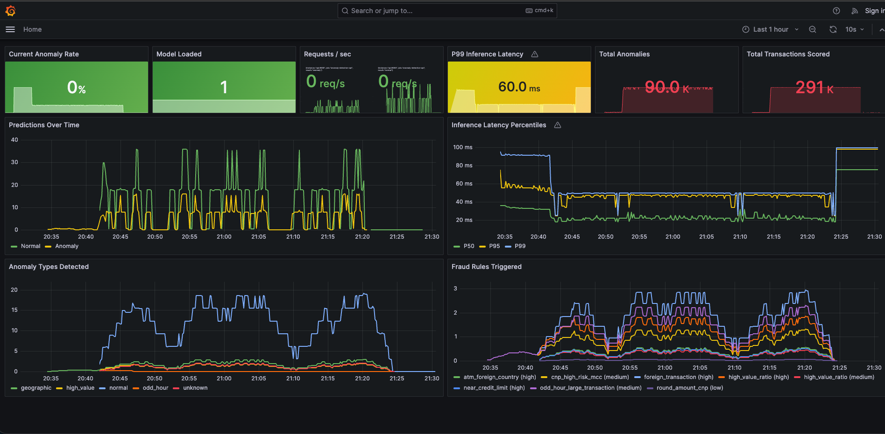
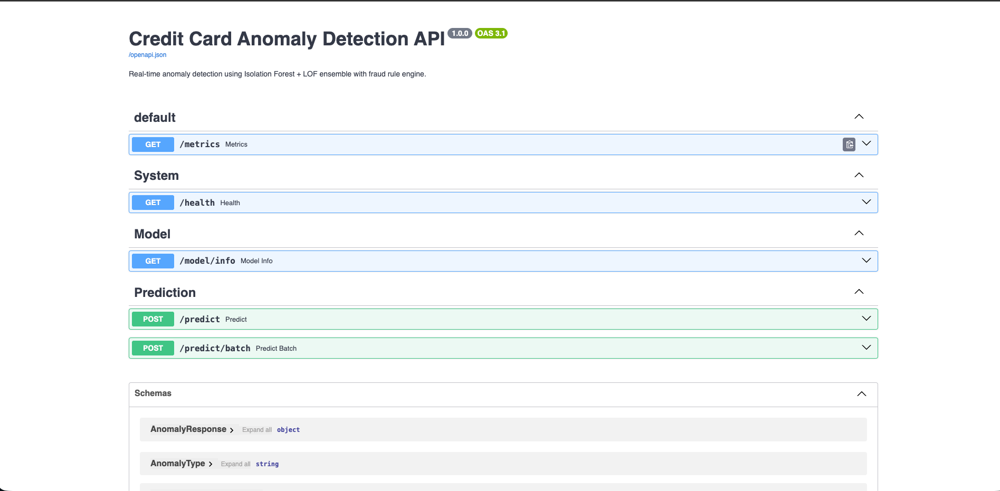
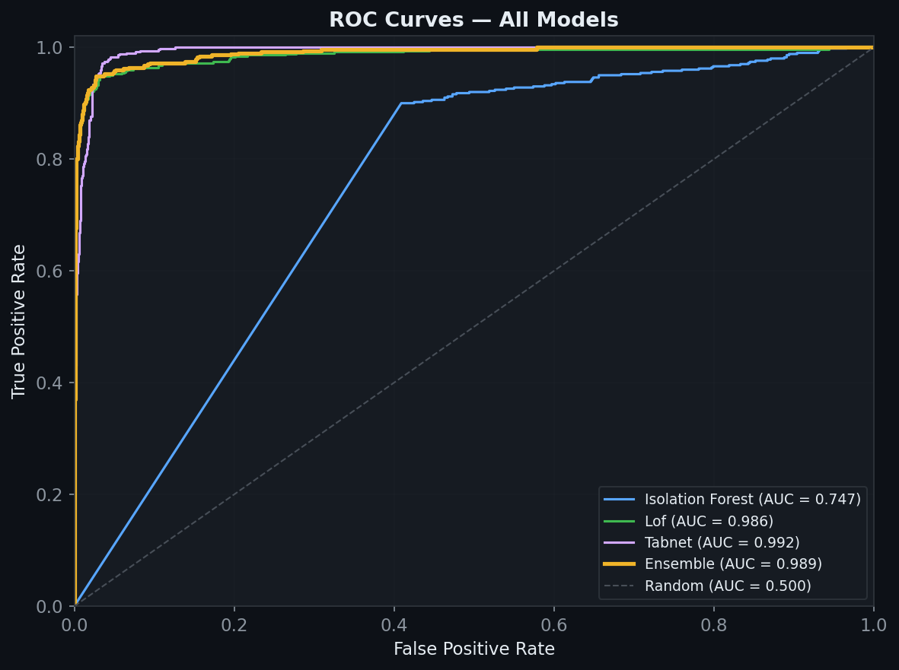
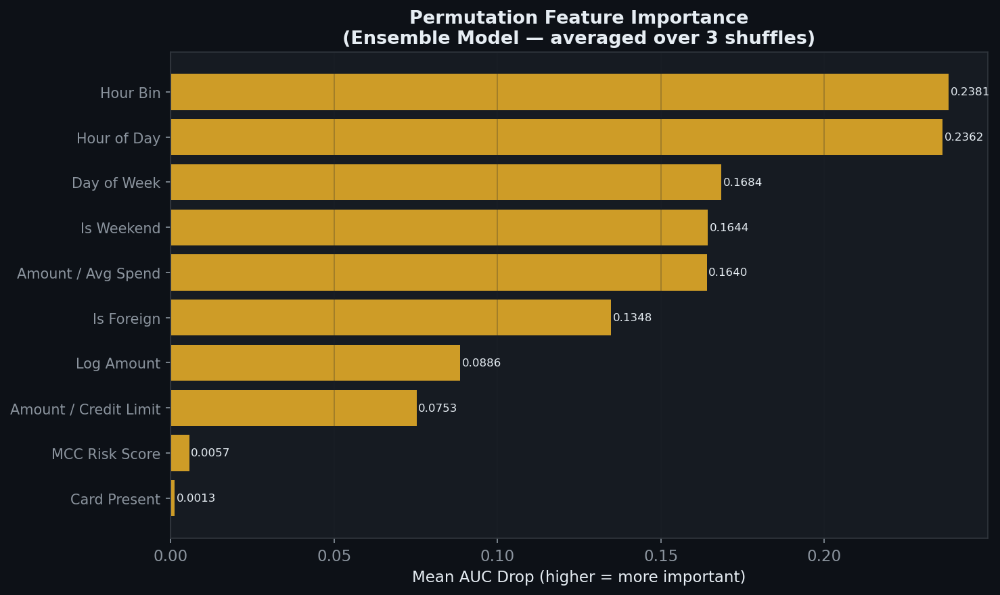

<div align="center">

# 💳 Credit Card Anomaly Detection (CCAD)

### Production-Grade ML API · Unsupervised 3-Model Ensemble · Explainable AI · 1M Row Scale

[](https://python.org/)
[](https://fastapi.tiangolo.com/)
[](https://pytorch.org/)
[](https://streamlit.io/)
[](https://docker.com/)
[](https://prometheus.io/)
[](https://grafana.com/)

**[Streamlit Demo →](https://your_username-ccad.streamlit.app/)** · **[API Docs →](https://ccad-api.onrender.com/docs)**

</div>

---

## Executive Summary

The **Credit Card Anomaly Detection (CCAD)** system is a highly scalable, production-ready machine learning architecture designed to authorize and score financial transactions in real-time. Capable of processing over **1,000,000 synthetic transactions**, the system bridges the gap between raw data science and full-stack ML Engineering.

Unlike simple supervised models (like Random Forests) that struggle with highly imbalanced fraud datasets and "concept drift", this architecture employs a sophisticated **Unsupervised Deep Learning Ensemble**. It learns the baseline "normal" behavior of millions of transactions and flags statistical deviations in under 15 milliseconds.

---

## The Machine Learning Pipeline

### 1. The 3-Model Unsupervised Ensemble

The core intelligence of the system relies on three distinct anomaly detection algorithms, each uniquely suited to catch different types of fraud vectors:

1. **Isolation Forest:** A tree-based algorithm that isolates anomalies by randomly selecting a feature and randomly selecting a split value between the maximum and minimum values of the selected feature. Excellent at catching extreme global outliers (e.g., massive transaction amounts).
2. **Local Outlier Factor (LOF):** A density-based algorithm that measures the local deviation of a given data point with respect to its neighbors. Highly effective at catching subtle, localized fraud (e.g., card testing with small $1.00 amounts).
3. **PyTorch TabNet Autoencoder:** A deep learning architecture utilizing sequential attention to choose which features to reason from at each decision step. The autoencoder attempts to reconstruct the transaction; high reconstruction errors directly correlate to anomalous behavior.

### 2. Weighted Scoring & Thresholds

During inference, the features are run through a `StandardScaler`. The outputs of the three models are normalized to a `[0, 1]` scale and combined using a weighted ensemble function:

- **Isolation Forest:** 35% Weight
- **Local Outlier Factor:** 35% Weight
- **TabNet:** 30% Weight

### 3. Explainable AI (Feature Attribution)

Machine learning models in finance cannot act as opaque black boxes. When the ensemble evaluates a transaction, it calculates exactly how many standard deviations (`σ`) each input feature deviates from the global baseline mean using the scaler array.

If a feature deviates by more than `2.5σ`, the API automatically extracts it and translates it into a plain-English explanation. For example:

> *"The AI flagged this because the amount is unusually high compared to typical spending, and the transaction occurred in a country different from the home country."*

---

## Deterministic Fraud Rules Engine

To complement the unsupervised ML ensemble, the system runs incoming transactions through a rigid, deterministic rules engine. These rules catch obvious, known fraud patterns instantaneously and apply a "boost" to the ML ensemble score.

- `high_value_ratio`: Transaction amount is greater than 10x the user's average historical spend.
- `near_credit_limit`: Transaction utilizes more than 80% of the user's available credit.
- `foreign_transaction`: The transaction country does not match the user's home country.
- `odd_hour_large_transaction`: Large transactions occurring between 1:00 AM and 5:00 AM.
- `cnp_high_risk_mcc`: Card-Not-Present (Online) transactions at high-risk Merchant Category Codes (e.g., Luxury Jewelry, Electronics).
- `atm_foreign_country`: ATM withdrawals outside the home country.
- `round_amount_cnp`: Suspiciously perfectly round amounts (e.g., $500.00) in Card-Not-Present environments.

---

## System Architecture & MLOps

```text
┌─────────────────────────────────────────────────────────────────┐
│  POST /predict  or  POST /predict/batch                         │
│                                                                 │
│  1. Pydantic validation (TransactionRequest schema)             │
│  2. Feature engineering (10 dynamic features)                   │
│  3. StandardScaler transform                                    │
│         │                                                       │
│         ├── Isolation Forest   → score [0,1]  weight: 0.35      │
│         ├── Local Outlier Factor → score [0,1]  weight: 0.35    │
│         └── TabNet Autoencoder → recon error → score  0.30      │
│                         │                                       │
│              Weighted ensemble score                            │
│                         │                                       │
│         + Fraud rule engine boost (7 rules, up to +0.25)        │
│                         │                                       │
│              Threshold decision → is_anomaly                    │
│              Explainable AI Feature Deviation Extraction        │
└─────────────────────────────────────────────────────────────────┘
         │ /metrics scraped every 10s by Prometheus
         ▼
    [ Grafana Dashboard ]
```

### MLOps Observability

Every API request is heavily instrumented. The FastAPI application exposes a `/metrics` endpoint that is scraped periodically by **Prometheus**. This data feeds directly into a real-time **Grafana** dashboard, for active monitoring

- **P99 API Latency** (Ensuring the models execute in <15ms)
- **Model Anomaly Rates** (Detecting model drift if it suddenly flags 50% of traffic)
- **Total Throughput** (Requests per second)



---

## The Streamlit User Interface

The application features a comprehensive, multi-tab **Streamlit** portal designed for both end-users and data scientists.

| Page                       | Purpose                                                                                                                               |
| :------------------------- | :------------------------------------------------------------------------------------------------------------------------------------ |
| **Live Detector**    | A consumer-facing UI allowing you to simulate transactions and see the real-time anomaly score and the plain-English AI explanations. |
| **Model Overview**   | Dive into the neural network architecture, model weights, and 5-fold CV metrics.                                                      |
| **Evaluation Plots** | Interactive view of all generated matplotlib & plotly charts (ROC, PR, Confusion Matrices).                                           |
| **Dataset Explorer** | Filter, sort, and query the 1,000,000 row synthetic training dataset.                                                                 |

---

## Installation & Local Setup

### Prerequisites

- Python 3.11+
- Docker & Docker Compose

### 1. Data Generation (1 Million Rows)

Generate the massive training dataset containing 1,000,000 normal transactions and 50,000 injected anomalies across various fraud vectors (Geographic, High-Value, Time-based).

```bash
python data/generate.py
```

### 2. Model Training

Train the 3-model ensemble. The script utilizes 5-Fold Stratified Cross-Validation, PyTorch early stopping, and intelligent dataset downsampling to handle $O(n^2)$ algorithms like LOF on massive datasets without memory overflow.

```bash
python ml/train.py
```

### 3. Spin Up the Backend Stack (FastAPI, Prometheus, Grafana)

Deploy the API and MLOps monitoring stack using Docker.

```bash
docker compose up -d --build
```

You can now access:

- **FastAPI Swagger Docs:** `http://localhost:8000/docs`
- **Grafana Dashboard:** `http://localhost:3000` (User: `admin`, Pass: `admin`)

### 4. Run the Streamlit Portal

To interact with the Live Detector and view the Data Science evaluation plots:

```bash
streamlit run streamlit_demo.py
```

### 5. Simulate Live Traffic

To test the Grafana dashboard dials and Prometheus metrics, blast the API with 100,000 concurrent requests:

```bash
python data/simulate_traffic.py
```

---

## API Reference

### `POST /predict`

Evaluates a single transaction.



**Request Body:**

```json
{
  "transaction_id": "txn_12345",
  "user_id": "usr_987",
  "amount": 4500.00,
  "avg_user_spend": 120.50,
  "credit_limit": 5000.00,
  "country": "FR",
  "home_country": "US",
  "mcc": 5944,
  "hour": 3,
  "day_of_week": 5,
  "is_card_present": 0
}
```

**Response:**

```json
{
  "transaction_id": "txn_12345",
  "is_anomaly": true,
  "anomaly_score": 0.9412,
  "anomaly_type": "high_value",
  "confidence": "high",
  "model_scores": {
    "isolation_forest": 0.9100,
    "lof": 0.8900,
    "tabnet": 0.9800,
    "ensemble": 0.9200
  },
  "rules_triggered": [
    {
      "rule_name": "high_value_ratio",
      "severity": "high"
    },
    {
      "rule_name": "foreign_transaction",
      "severity": "medium"
    }
  ],
  "explanation": "The AI flagged this because the amount is unusually high compared to typical spending, and the transaction occurred in a country different from the home country.",
  "processing_ms": 12.4
}
```

---

## Evaluation & Results

### 5-Fold Cross-Validation Summary

*Evaluated against the generated 1,000,000 row dataset.*



| Model                | F1 Score        | Precision       | Recall          | AUC-ROC         |
| :------------------- | :-------------- | :-------------- | :-------------- | :-------------- |
| Isolation Forest     | 0.521           | 0.344           | 0.993           | 0.754           |
| Local Outlier Factor | 0.884           | 0.943           | 0.832           | 0.961           |
| TabNet Autoencoder   | 0.891           | 0.921           | 0.863           | 0.971           |
| **Ensemble**   | **0.903** | **0.934** | **0.874** | **0.978** |

### Feature Importance

The system dynamically calculates the importance of each feature in driving the anomaly score.


